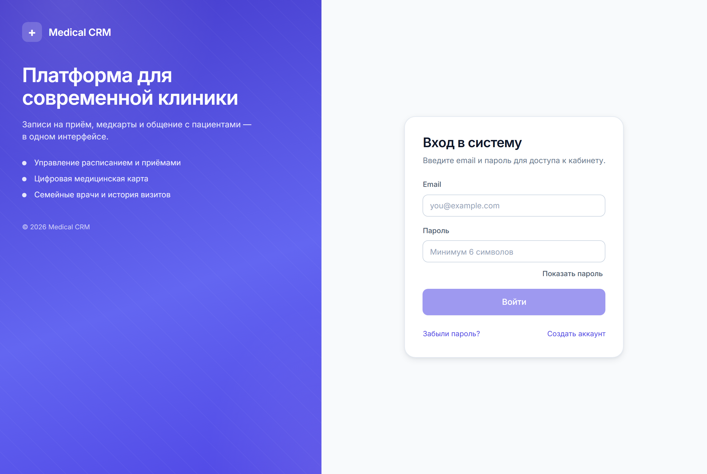
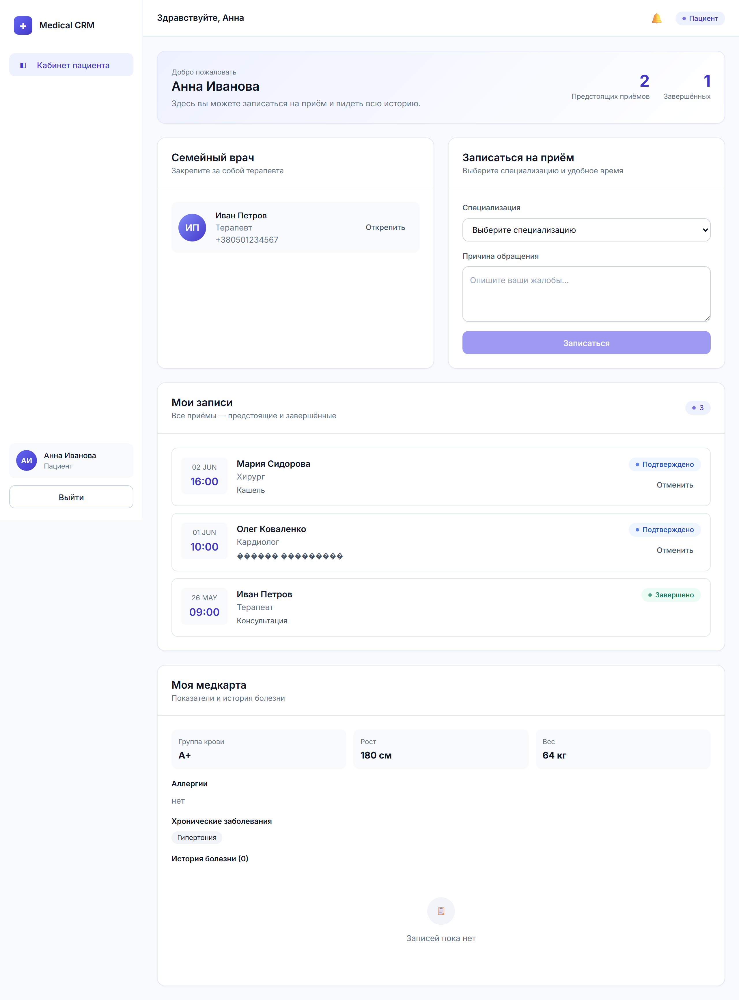
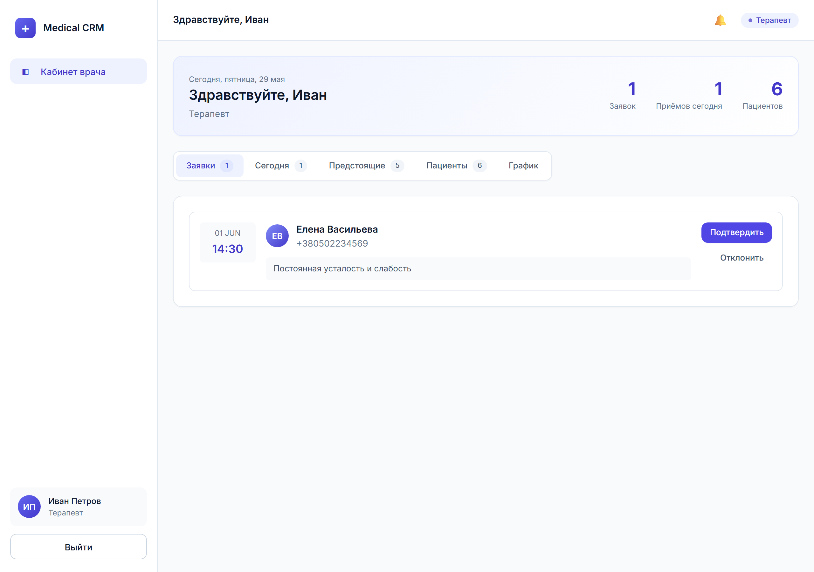
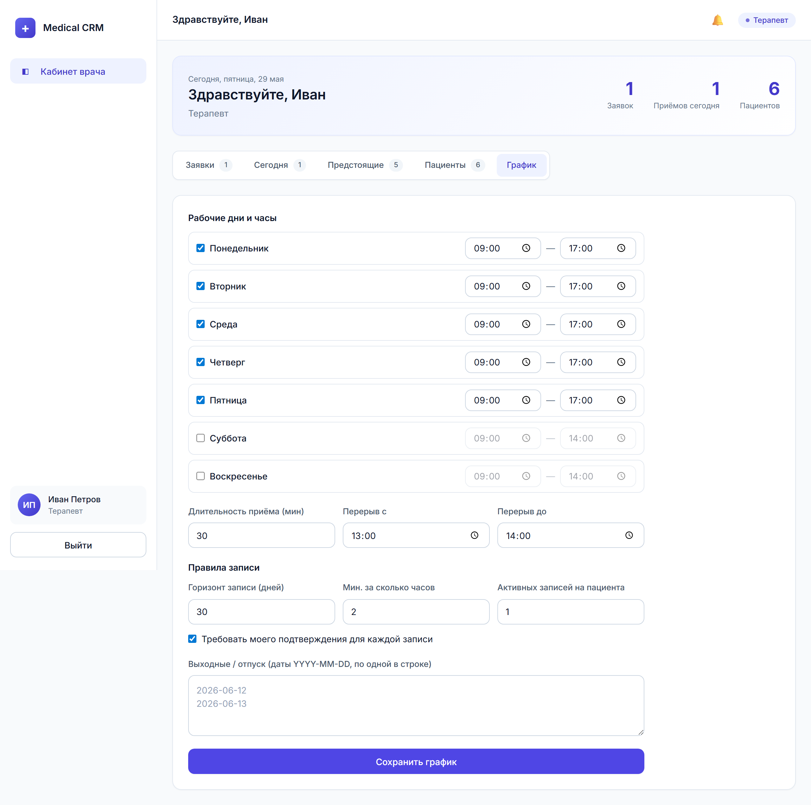
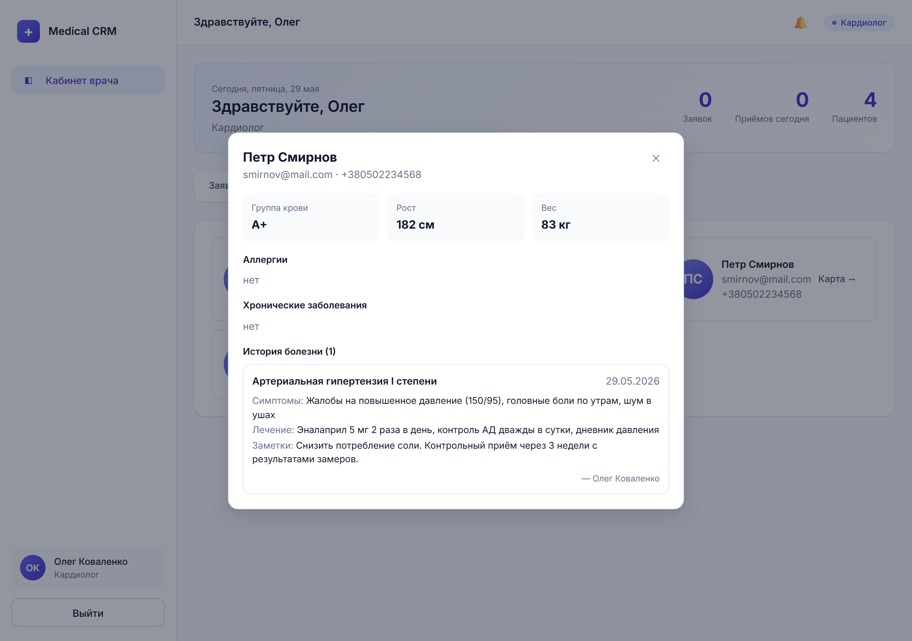
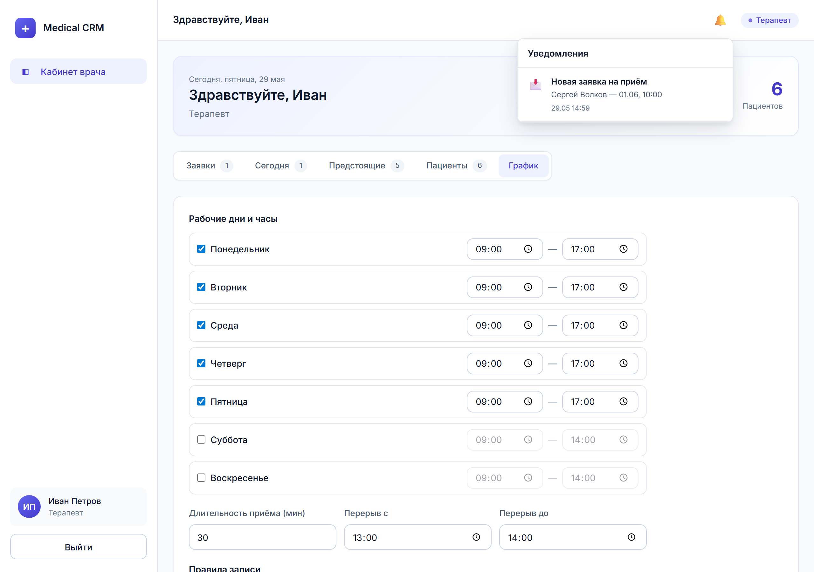

# Medical CRM System

Медицинская CRM для врачей и пациентов: запись на приём по графику врача, подтверждение заявок, ведение медкарт с контролем доступа и уведомления.

**Стек:** NestJS 11 + MongoDB (backend), Angular 19 (frontend), pnpm 10.

## Интерфейс

### Вход


### Кабинет пациента
Запись на приём, семейный врач, список приёмов со статусами и собственная медкарта.



### Кабинет врача — заявки
Входящие заявки на приём с подтверждением и отклонением.



### Кабинет врача — график и правила записи
Рабочие дни и часы, длительность приёма, перерыв, выходные и правила записи (горизонт, минимальное время до приёма, лимит активных записей, требование подтверждения).



### Карта пациента (глазами врача)
Показатели, аллергии, хронические заболевания и история болезни. Доступна только семейному врачу или врачу, к которому пациент записан.



### Уведомления
Колокольчик в шапке: новые заявки, подтверждения, отклонения, завершения и отмены приёмов.



## Функциональность

### Аутентификация
- Регистрация и авторизация, access/refresh токены
- Восстановление пароля через SMTP (опционально)

### Пациент
- Запись на приём: выбор специализации → врача → даты → свободного слота
- Слоты считаются из графика врача (рабочие часы − перерыв − выходные − занятые)
- Заключение договора с терапевтом (семейный врач)
- Просмотр своей медкарты и истории болезни
- Отмена записи

### Врач
- Свой график приёма и правила записи (настраиваемые)
- Подтверждение / отклонение заявок
- Завершение приёма с записью в медкарту пациента (симптомы, диагноз, лечение)
- Просмотр медкарт своих пациентов (с контролем доступа)

### Уведомления (in-app)
Уведомления приходят обеим сторонам на ключевые события: новая заявка, подтверждение, отклонение, завершение приёма, отмена.

## Установка

Подробная инструкция (Windows) — в [QUICK_START.md](QUICK_START.md) и [INSTALLATION.md](INSTALLATION.md).

```powershell
# 1. MongoDB как служба
winget install MongoDB.Server

# 2. Зависимости (корень + backend + frontend)
pnpm install:all

# 3. Тестовые данные
pnpm --dir backend run seed

# 4. Запуск фронта и бэка одной командой
pnpm dev
```

Приложение: `http://localhost:4200` · API: `http://localhost:3000`

**Тестовые учётные данные:**
- Врач: `petrov@hospital.com` / `password123`
- Пациент: `ivanova@mail.com` / `password123`

Конфигурация backend — переменные с пояснениями в [backend/.env.example](backend/.env.example) (для локалки `.env` не обязателен, всё работает на дефолтах).

## Структура проекта

```
medical-crm/
├── backend/                    # NestJS API
│   └── src/
│       ├── auth/               # Аутентификация
│       ├── appointments/       # Записи на приём (слоты, подтверждение, завершение)
│       ├── doctor-schedules/   # Графики и правила записи врачей
│       ├── medical-cards/      # Медкарты + контроль доступа
│       ├── family-doctors/     # Семейные врачи
│       ├── notifications/      # Уведомления
│       └── seeder/             # Тестовые данные
└── frontend/                   # Angular 19
    └── src/app/
        ├── pages/              # Логин, кабинеты врача и пациента
        ├── components/         # Колокольчик уведомлений
        ├── services/           # HTTP-сервисы
        └── layouts/            # Каркас приложения
```

## API Endpoints

### Auth
- `POST /auth/register` · `POST /auth/login` · `POST /auth/refresh`
- `POST /auth/forgot-password` · `POST /auth/reset-password` · `POST /auth/logout`

### Appointments
- `POST /appointments` — создать запись (проверка слота и правил)
- `GET /appointments/my` — мои записи (пациент)
- `GET /appointments/doctor` — записи врача
- `GET /appointments/patients` — пациенты врача
- `GET /appointments/doctors` — доступные врачи
- `GET /appointments/slots?doctorId&date` — свободные слоты
- `PATCH /appointments/:id/confirm` — подтвердить (врач)
- `PATCH /appointments/:id/reject` — отклонить (врач)
- `PATCH /appointments/:id/complete` — завершить + запись в карту (врач)
- `DELETE /appointments/:id` — отменить

### Doctor Schedules
- `GET /doctor-schedules/me` — мой график (врач)
- `PUT /doctor-schedules/me` — обновить график и правила (врач)

### Medical Cards
- `GET /medical-cards/my` — моя медкарта (пациент)
- `GET /medical-cards/patient/:id` — карта пациента (врач, с контролем доступа)
- `POST /medical-cards/record` — добавить запись (врач)
- `PATCH /medical-cards` — обновить медкарту

### Family Doctors
- `POST /family-doctors` · `GET /family-doctors/my` · `GET /family-doctors/patients` · `DELETE /family-doctors`

### Notifications
- `GET /notifications` — мои уведомления
- `GET /notifications/unread-count` — число непрочитанных
- `PATCH /notifications/:id/read` · `PATCH /notifications/read-all`

## Тестовые данные

После `pnpm --dir backend run seed`:
- 3 врача разных специальностей (с графиками приёма)
- 7 пациентов с медкартами
- 10 приёмов + заявки в ожидании подтверждения
